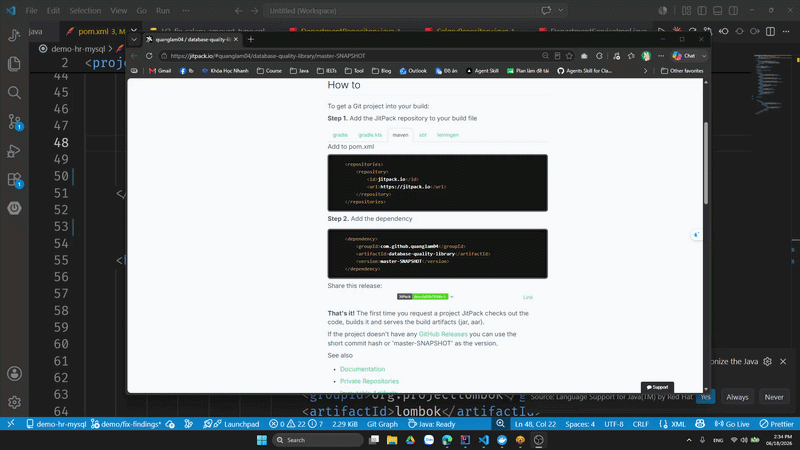
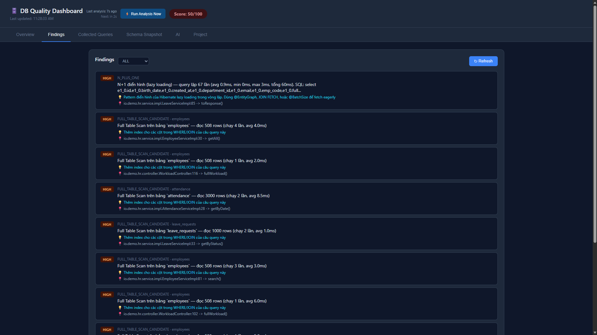
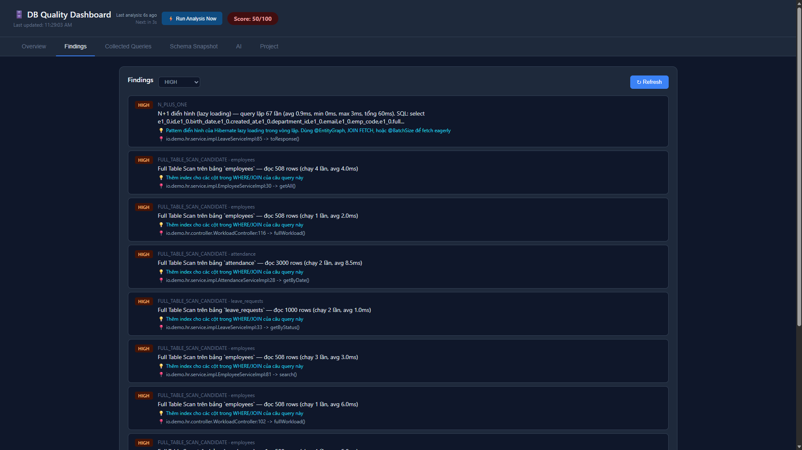
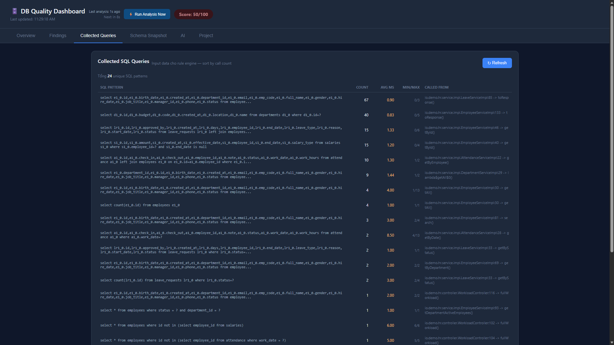
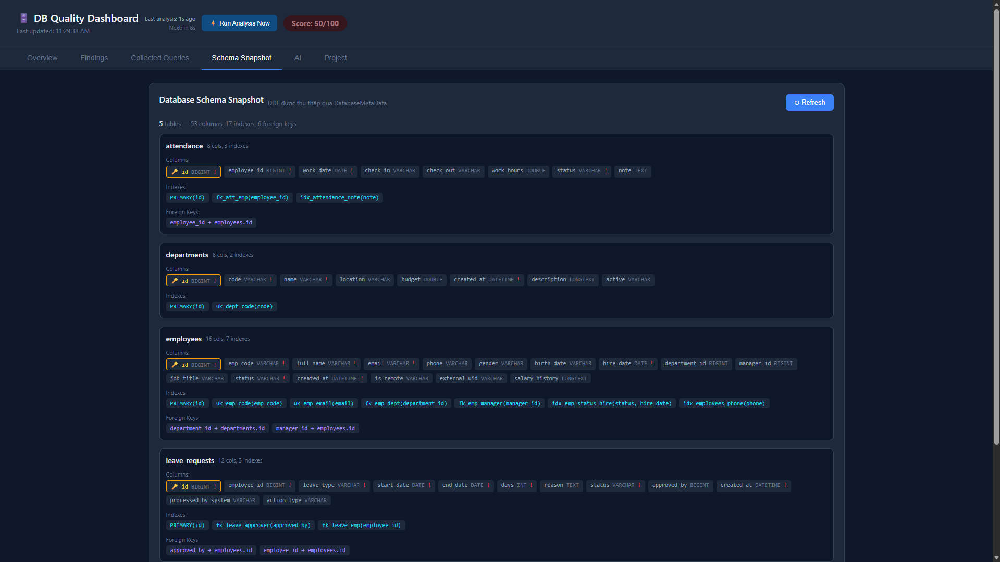
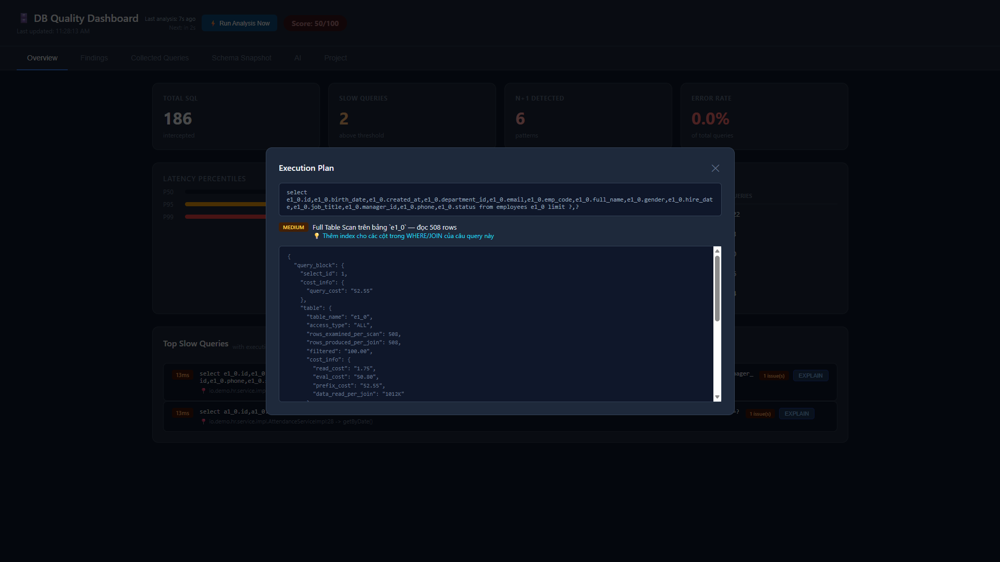
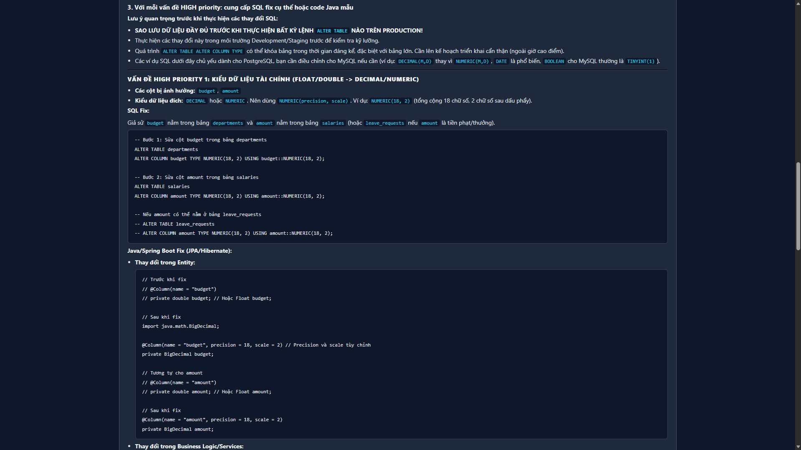

# Database Quality Library

[](https://openjdk.org/)
[](https://maven.apache.org/)
[](https://jitpack.io/#quanglam04/database-quality-library)
[](LICENSE)

> Thư viện Java phân tích chất lượng tương tác giữa ứng dụng và database tại runtime

---


---

## Mục lục

- [Cách hoạt động](#cách-hoạt-động)
- [Kiến trúc 2 tầng](#kiến-trúc-2-tầng)
- [Yêu cầu](#yêu-cầu)
- [Cài đặt](#cài-đặt)
- [Tích hợp](#tích-hợp)
  - [Plain Java](#plain-java)
  - [Spring Boot (Auto-configuration)](#spring-boot-auto-configuration)
  - [Spring Boot (thủ công)](#spring-boot-thủ-công)
  - [Micronaut](#micronaut)
- [Cấu hình](#cấu-hình)
- [Dashboard](#dashboard)
- [Rules](#rules)
- [Execution Plan Analysis](#execution-plan-analysis)
- [AI Integration](#ai-integration)
- [Export Report](#export-report)
- [Custom Rules](#custom-rules)
- [Mở rộng AI Provider](#mở-rộng-ai-provider)
- [Database được hỗ trợ](#database-được-hỗ-trợ)
- [Cấu trúc project](#cấu-trúc-project)
- [FAQ](#faq)

---

## Cách hoạt động

Thư viện đứng giữa ứng dụng và database, âm thầm intercept toàn bộ JDBC calls để thu thập SQL queries, thời gian thực thi, và cấu trúc schema. Sau đó chạy một bộ rules để phát hiện các vấn đề như thiếu index, N+1 queries, slow queries, và nhiều hơn nữa.

```
Không có thư viện:   App → DataSource → Database

Có thư viện:         App → QualityDataSource → DataSource → Database
                                      ↓
                              Thu thập + Phân tích
                                      ↓
                         Dashboard · JSON Report · AI Insights
```

Ứng dụng không biết mình đang bị intercept — vẫn sử dụng `DataSource` như bình thường. Toàn bộ service classes, repositories, và business logic không bị đụng đến.

---

## Kiến trúc 2 tầng

Thư viện tách rõ 2 layer hoạt động song song:

```
┌─────────────────────────────────────────────────────────────┐
│  COLLECTION LAYER  (realtime, mỗi lần SQL chạy)             │
│                                                             │
│  JDBC Intercept → QueryMetricsStore (aggregated metrics)    │
│                 → DDLContext (schema snapshot)              │
└─────────────────────────────────────────────────────────────┘
                            ↓
┌─────────────────────────────────────────────────────────────┐
│  ANALYSIS LAYER  (scheduled, theo interval cấu hình)        │
│                                                             │
│  ScheduledAnalysisJob → Warm ExplainCache                   │
│                       → Chạy 10 rules                       │
│                       → Lưu AnalysisResultStore             │
└─────────────────────────────────────────────────────────────┘
```

**Tại sao tách 2 tầng:**

- **Collection** chạy mỗi query → phải cực nhẹ (chỉ ghi metric vào in-memory map). Không có rule analysis ở đây.
- **Analysis** chạy theo interval (mặc định 5 phút) → có thể tốn nhiều thời gian hơn cho EXPLAIN, schema cross-check, rule evaluation mà không ảnh hưởng request thực tế.
- Tất cả rule đều đọc từ **aggregated metrics** chứ không phải từng SQL record → phát hiện được pattern (N+1, slow query, full scan thường xuyên) thay vì chỉ 1 event đơn lẻ.

Có thể trigger analysis ngay bằng nút **⚡ Run Analysis Now** trên dashboard mà không cần đợi interval tiếp theo.

---

## Yêu cầu

- Java 17+
- Bất kỳ SQL database nào có JDBC driver (MySQL, PostgreSQL, MariaDB, SQL Server, H2, ...)
- Maven 3.8+

---

## Cài đặt

### Cách 1 — JitPack (khuyến nghị)

Thêm JitPack repository và dependency vào `pom.xml`:

```xml
<repositories>
    <repository>
        <id>jitpack.io</id>
        <url>https://jitpack.io</url>
        <releases>
            <enabled>true</enabled>
        </releases>
        <snapshots>
            <enabled>true</enabled>
        </snapshots>
    </repository>
</repositories>

<dependencies>
    <dependency>
        <groupId>com.github.quanglam04</groupId>
        <artifactId>database-quality-library</artifactId>
        <version>master-SNAPSHOT</version> <!-- Luôn dùng bản mới nhất của branch master -->
    </dependency>
</dependencies>
```

Hoặc dùng commit hash cụ thể để pin version:

```xml
<version>dev-{COMMIT_HASH}-1</version>
<!-- Ví dụ: dev-fb0371caf1-1 -->
```

### Cách 2 — Build local

```bash
git clone https://github.com/quanglam04/database-quality-library.git
cd database-quality-library
mvn clean install -DskipTests
```

Sau đó thêm dependency:

```xml
<dependency>
    <groupId>com.dbquality</groupId>
    <artifactId>db-quality-library</artifactId>
    <version>1.0-SNAPSHOT</version>
</dependency>
```

---

## Tích hợp

### Plain Java

Wrap `DataSource` hiện có bằng `QualityDataSource`. Đây là cách tích hợp cơ bản nhất — hoạt động với **mọi Java application** không phụ thuộc framework:

```java
// Khởi tạo DataSource gốc (HikariCP, c3p0, DBCP, ...)
HikariConfig hikariConfig = new HikariConfig();
hikariConfig.setJdbcUrl("jdbc:postgresql://localhost:5432/mydb");
hikariConfig.setUsername("user");
hikariConfig.setPassword("password");
DataSource original = new HikariDataSource(hikariConfig);

// Wrap bằng QualityDataSource — đọc config từ application.properties
QualityConfig config = QualityConfig.fromClasspath();
DataSource monitored = new QualityDataSource(original, config);

// Dùng monitored thay cho original — không cần thay đổi gì khác
Connection conn = monitored.getConnection();
```

> **Lưu ý:** Nếu dùng Flyway hoặc migration tool khác, chạy migration trên `DataSource` gốc trước khi wrap — để tránh system queries của Flyway bị intercept.

```java
// Chạy Flyway trên DataSource gốc
Flyway.configure().dataSource(original).load().migrate();

// Sau đó mới wrap
DataSource monitored = new QualityDataSource(original, config);
```

### Spring Boot (Auto-configuration)

Nếu `spring-boot-autoconfigure` có trong classpath, **không cần thêm bất kỳ class nào** — thư viện tự động detect và wrap `DataSource` khi khởi động.

Chỉ cần thêm dependency và cấu hình trong `application.properties`:

```properties
quality.enabled=true
quality.dashboard.port=9876
```

### Spring Boot (thủ công)

Nếu muốn kiểm soát cấu hình hoặc tắt auto-configuration:

```java
@Configuration
public class DataSourceConfig {

    @Bean
    @Primary
    public DataSource qualityDataSource(DataSource original) {
        return new QualityDataSource(original, QualityConfig.fromClasspath());
    }
}
```

### Micronaut

Micronaut không có auto-configuration như Spring Boot, cần tạo một `@Factory` để replace `DataSource` bean mặc định:

```java
@Factory
public class DataSourceConfig {

    @Singleton
    @Replaces(DataSource.class)
    public DataSource dataSource() {
        HikariConfig hikariConfig = new HikariConfig();
        hikariConfig.setJdbcUrl(System.getenv()
            .getOrDefault("DATASOURCES_DEFAULT_URL", "jdbc:postgresql://localhost:5432/mydb"));
        hikariConfig.setUsername(System.getenv()
            .getOrDefault("DATASOURCES_DEFAULT_USERNAME", "user"));
        hikariConfig.setPassword(System.getenv()
            .getOrDefault("DATASOURCES_DEFAULT_PASSWORD", "password"));
        hikariConfig.setMaximumPoolSize(10);

        DataSource original = new HikariDataSource(hikariConfig);

        // Chạy Flyway trên DataSource gốc trước khi wrap
        Flyway.configure().dataSource(original).load().migrate();

        QualityConfig config = QualityConfig.fromClasspath();
        return new QualityDataSource(original, config);
    }
}
```

Thêm config vào `application.yml`:

```yaml
quality:
  enabled: true
  dashboard:
    enabled: true
    port: 9876
  slow-query-threshold-ms: 200
```

---

## Cấu hình

Tất cả properties đều có giá trị mặc định — chỉ cần override những gì muốn thay đổi. Thư viện đọc từ `application.properties` trên classpath qua `QualityConfig.fromClasspath()`.

```properties
# ── Chung ────────────────────────────────────────────────────────────
# Bật/tắt toàn bộ thư viện (mặc định: true)
quality.enabled=true

# Ngưỡng slow query tính bằng milliseconds (mặc định: 500)
quality.slow-query-threshold-ms=500

# Ngưỡng phát hiện N+1 — số lần lặp lại của cùng 1 query pattern (mặc định: 10)
quality.n-plus-one-threshold=10

# Sampling rate — 1.0 nghĩa là capture 100% queries (mặc định: 1.0)
quality.sampling-rate=1.0

# ── Analysis (mới) ───────────────────────────────────────────────────
# Bật scheduled analysis job (mặc định: true)
# Nếu false, chỉ chạy analysis khi bấm "Run Analysis Now" trên dashboard
quality.analysis.scheduled=true

# Chu kỳ chạy analysis. Hỗ trợ duration friendly: 30s, 5m, 1h, 24h (mặc định: 5m)
quality.analysis.interval=5m

# Delay trước lần analysis đầu tiên sau khi app khởi động (mặc định: 30s)
# Cho app có thời gian warm-up và collect đủ SQL trước khi phân tích
quality.analysis.initial-delay=30s

# ── Dashboard ─────────────────────────────────────────────────────────
# Bật/tắt dashboard HTTP server (mặc định: true)
quality.dashboard.enabled=true

# Port của dashboard (mặc định: 9876)
quality.dashboard.port=9876

# ── Export ────────────────────────────────────────────────────────────
# Tự động export JSON report khi app shutdown (mặc định: false)
quality.export.json.enabled=false

# Đường dẫn file JSON output (mặc định: quality-report.json)
quality.export.json.path=quality-report.json

# ── AI Integration ────────────────────────────────────────────────────
# Bật/tắt tích hợp AI (mặc định: false)
quality.ai.enabled=false

# Provider: openai / claude / gemini (mặc định: openai)
quality.ai.provider=openai

# API key của provider
quality.ai.api-key=YOUR_API_KEY

# Tên model (mặc định: gpt-4o)
quality.ai.model=gpt-4o
```

---

## Dashboard

Khi thư viện khởi động, dashboard tự động chạy tại `http://localhost:9876`.

<p align="center">
  
  <br/>
  <em>Tab Overview — score badge ở header, 4 metric cards, latency percentiles, top tables theo tần suất, và top slow queries kèm nút EXPLAIN. Header có nút "Run Analysis Now" để trigger phân tích ngay không cần đợi interval.</em>
</p>

Dashboard được chia thành **6 tab**:

| Tab | Nội dung |
|---|---|
| **Overview** | Score badge, 4 metric cards (Total SQL / Slow Queries / N+1 / Error Rate), latency percentiles P50/P95/P99, top tables theo tần suất, top slow queries với nút EXPLAIN |
| **Findings** | Danh sách tất cả findings được phân trang (10/trang), filter theo severity |
| **Collected Queries** | Input transparency — toàn bộ SQL pattern đã intercept với call count, avg/min/max duration, và calledFrom |
| **Schema Snapshot** | DDL đã thu thập qua `DatabaseMetaData` — tables, columns, indexes, foreign keys |
| **AI** | AI-ready context để copy/export, AI Insights từ LLM (nếu được bật) |
| **Project** | Thông tin database, framework, ORM, connection pool, JVM, memory |

<p align="center">
  
  <br/>
  <em>Tab Findings — danh sách findings sắp xếp theo severity (CRITICAL → HIGH → MEDIUM → WARNING), kèm message, recommendation và vị trí gọi trong code.</em>
</p>

<p align="center">
  
  <br/>
  <em>Lọc findings theo từng mức severity để tập trung xử lý vấn đề ưu tiên cao trước.</em>
</p>

<p align="center">
  
  <br/>
  <em>Tab Collected Queries — minh bạch input của rule engine. Hiển thị toàn bộ SQL pattern đã được normalize, kèm metrics tổng hợp (call count, avg/min/max duration) và vị trí code gọi nhiều nhất.</em>
</p>

<p align="center">
  
  <br/>
  <em>Tab Schema Snapshot — minh bạch input DDL. Hiển thị cấu trúc schema thu thập qua DatabaseMetaData lúc startup: tables, columns kèm kiểu dữ liệu và ràng buộc nullable, indexes, và foreign keys.</em>
</p>

<p align="center">
  
  <br/>
  <em>Modal Execution Plan hiển thị khi bấm nút EXPLAIN trên slow query — bao gồm findings phát hiện từ plan (full scan, low selectivity...) và raw JSON output của EXPLAIN.</em>
</p>

<p align="center">
  
  <br/>
  <em>Tab AI (phần trên) — hiển thị AI-ready context: prompt structured được build từ schema summary, top findings, metrics, và slow queries. Có thể copy hoặc export để dùng với bất kỳ LLM nào.</em>
</p>

<p align="center">
  
  <br/>
  <em>Tab AI (phần dưới) — AI Insights được render từ markdown response của LLM với hỗ trợ code block, table, list, blockquote. Hữu ích để LLM phân tích sâu hơn và đề xuất SQL fix cụ thể.</em>
</p>

<p align="center">
  
  <br/>
  <em>Tab Project — thông tin runtime: database product/version, framework (Spring Boot/Quarkus/Micronaut), ORM, connection pool, JVM heap usage, và uptime.</em>
</p>

### API Endpoints

| Endpoint | Method | Mô tả |
|---|---|---|
| `/` | GET | HTML dashboard |
| `/metrics` | GET | Realtime metrics đọc từ `QueryMetricsStore` (JSON) |
| `/collected-queries` | GET | Toàn bộ SQL pattern + aggregated metrics (JSON) |
| `/schema-snapshot` | GET | DDL schema đã thu thập (JSON) |
| `/findings` | GET | Findings từ analysis gần nhất, đọc từ cache (JSON) |
| `/report` | GET | Báo cáo đầy đủ (JSON) |
| `/slow-queries` | GET | Slow queries kèm execution plan (JSON) |
| `/ai-context` | GET | AI-ready context prompt (JSON) |
| `/project-info` | GET | Thông tin project và môi trường (JSON) |
| `/analysis-status` | GET | Trạng thái analysis job — lastRun, nextRun, scheduled enabled |
| `/analyze-now` | POST | Trigger manual analysis ngay (không đợi interval) |
| `/ai-refresh` | POST | Reset AI cache để gọi lại LLM |

### Tắt dashboard

```properties
quality.dashboard.enabled=false
```

---

## Rules

### Tổng quan

Thư viện tích hợp sẵn **10 rules**, chạy theo scheduled analysis job (mặc định 5 phút/lần) hoặc trigger thủ công:

| Rule | Mô tả | Severity | Nguồn data |
|---|---|---|---|
| `MISSING_PRIMARY_KEY` | Bảng không có primary key | CRITICAL | DDL |
| `UNINDEXED_FOREIGN_KEY` | Cột foreign key không có index | HIGH | DDL |
| `SELECT_STAR` | Query dùng `SELECT *` | MEDIUM | Metrics |
| `N_PLUS_ONE` | Pattern lặp nhiều lần — phân loại theo count + variance + duration | Dynamic (HIGH/MEDIUM/WARNING) | Metrics |
| `SLOW_QUERY` | Query có max duration vượt ngưỡng | HIGH | Metrics |
| `FULL_TABLE_SCAN_CANDIDATE` | EXPLAIN cho thấy full table scan | Dynamic (HIGH/MEDIUM) | EXPLAIN + Metrics |
| `UNUSED_INDEX` | Index không xuất hiện trong bất kỳ EXPLAIN nào | WARNING | DDL + EXPLAIN |
| `SUSPICIOUS_DATA_TYPE` | Kiểu dữ liệu cột không phù hợp (FLOAT cho tài chính, VARCHAR cho date) | WARNING | DDL |
| `NULLABLE_RISK` | Cột nullable được dùng trong WHERE | WARNING | DDL + Metrics |
| `MISSING_INDEX` | EXPLAIN xác định cột WHERE/JOIN chưa có index | MEDIUM | EXPLAIN + DDL |

### DDL rules vs Metrics-based rules

- **DDL rules** (`MISSING_PRIMARY_KEY`, `UNINDEXED_FOREIGN_KEY`, `SUSPICIOUS_DATA_TYPE`) — detect ngay khi khởi động từ `DatabaseMetaData`, không cần SQL nào được thực thi.
- **Metrics-based rules** (`SELECT_STAR`, `N_PLUS_ONE`, `SLOW_QUERY`, ...) — cần SQL thực tế chạy qua mới detect được. Chạy workload hoặc gọi API trước khi xem findings.
- **EXPLAIN-based rules** (`FULL_TABLE_SCAN_CANDIDATE`, `MISSING_INDEX`, `UNUSED_INDEX`) — dùng kết quả `EXPLAIN` thật cho từng SQL pattern (cache lại để overhead minimal) thay vì regex heuristic. Chính xác hơn, ít false positive.

### N+1 phân loại theo metrics

Rule `N_PLUS_ONE` không chỉ đếm số lần lặp mà phân tích theo nhiều chỉ số:

| Pattern | Đặc điểm | Severity |
|---|---|---|
| **Điển hình (lazy loading)** | Query nhỏ + duration ổn định + lặp nhiều | HIGH/MEDIUM theo count |
| **Nghiêm trọng** | Query nặng (avg ≥ 50ms) + lặp nhiều | HIGH |
| **Biến động** | Variance lớn — có thể do cache miss/hit | Dynamic |

Severity dựa trên cả **callCount** và **total impact (ms)**:
- HIGH: `callCount ≥ 50` HOẶC `total impact > 1000ms`
- MEDIUM: `callCount ≥ 20` HOẶC `total impact > 200ms`
- WARNING: còn lại

### Scoring

Report bao gồm điểm chất lượng tổng thể từ 0 đến 100:

```
Score = 100
      - min(critical_count × 20, 60)
      - min(high_count    × 10, 30)
      - min(medium_count  ×  3, 15)
      - min(warning_count ×  1,  5)
```

Hover chuột vào score badge trên header để xem công thức tính.

---

## Execution Plan Analysis

Sau refactor, các rule `FULL_TABLE_SCAN_CANDIDATE`, `MISSING_INDEX`, `UNUSED_INDEX` đều dựa trên **kết quả EXPLAIN thật** thay vì regex heuristic. Mỗi unique SQL pattern chỉ chạy EXPLAIN 1 lần (cache lại) — overhead minimal ngay cả với app có hàng nghìn query.

| Finding | Mô tả |
|---|---|
| `FULL_TABLE_SCAN` | `access_type: ALL` (MySQL) / `Seq Scan` (PostgreSQL) / `Table Scan` (SQL Server) |
| `FULL_INDEX_SCAN` | `access_type: index` — scan toàn bộ index |
| `INDEX_NOT_USED` | Có possible keys nhưng không dùng index nào |
| `LOW_INDEX_SELECTIVITY` | Index có selectivity thấp (MariaDB) |
| `PLANNER_ESTIMATE_MISMATCH` | Planner ước tính sai số rows thực tế (PostgreSQL) |
| `SORT_TO_DISK` | Sort tràn ra disk thay vì in-memory (PostgreSQL) |
| `NESTED_LOOP_LARGE` | Nested loop join trên tập dữ liệu lớn (PostgreSQL) |

Kết quả được hiển thị trong modal khi click nút **EXPLAIN** trên tab Overview.

### Database được hỗ trợ cho Execution Plan

| Database | Cú pháp | Trạng thái |
|---|---|---|
| MySQL 5.6+ | `EXPLAIN FORMAT=JSON` | Hỗ trợ |
| MariaDB 10.1+ | `EXPLAIN FORMAT=JSON` | Hỗ trợ |
| PostgreSQL | `EXPLAIN (FORMAT JSON, ANALYZE)` | Hỗ trợ |
| SQL Server | XML execution plan | Hỗ trợ |
| Oracle | `EXPLAIN PLAN FOR` | Planned |
| Khác | — | Bỏ qua, không ảnh hưởng tính năng khác |

---

## AI Integration

Khi được bật, thư viện tự động gọi LLM provider với structured prompt được build từ report — bao gồm schema summary, top findings, metrics, và slow queries với calledFrom.

### Cấu hình

```properties
quality.ai.enabled=true
quality.ai.provider=gemini       # openai / claude / gemini
quality.ai.api-key=YOUR_KEY
quality.ai.model=gemini-2.5-flash
```

### Providers được hỗ trợ

| Provider | Model ví dụ | Trạng thái |
|---|---|---|
| OpenAI | `gpt-4o`, `gpt-4-turbo` | Có |
| Anthropic Claude | `claude-sonnet-4-6`, `claude-haiku-4-5-20251001` | Có |
| Google Gemini | `gemini-2.5-flash`, `gemini-1.5-pro` | Có |
| DeepSeek | `deepseek-chat` | Đang phát triển |
| Grok (xAI) | `grok-2` | Đang phát triển |

**Fallback:** Nếu AI bị tắt hoặc API call thất bại (quota, invalid key, overload), thư viện tự động fallback về rule-based output — không throw exception, ứng dụng vẫn hoạt động bình thường.

### AI-ready context (không cần API key)

Dù không bật AI integration, bạn vẫn có thể copy hoặc export AI-ready context từ tab **AI** trên dashboard và paste vào bất kỳ LLM nào (ChatGPT, Claude, Gemini) để nhận phân tích.

---

## Export Report

Khi app shutdown, thư viện tự động export report ra file JSON nếu được bật:

```properties
quality.export.json.enabled=true
quality.export.json.path=reports/quality-report.json
```

Ví dụ output:

```json
{
  "reportGeneratedAt": "2026-06-17T10:30:00Z",
  "overallScore": 62,
  "ddlFindings": [
    {
      "rule": "MISSING_PRIMARY_KEY",
      "severity": "CRITICAL",
      "table": "event_log",
      "message": "Bảng event_log không có Primary Key",
      "recommendation": "Thêm cột id BIGINT AUTO_INCREMENT PRIMARY KEY",
      "calledFrom": "Schema analysis — no call site"
    }
  ],
  "sqlFindings": [
    {
      "rule": "N_PLUS_ONE",
      "severity": "HIGH",
      "message": "N+1 điển hình (lazy loading) — query lặp 67 lần (avg 0.7ms, min 0ms, max 2ms, tổng 50ms)",
      "recommendation": "Pattern điển hình của Hibernate lazy loading trong vòng lặp. Dùng @EntityGraph, JOIN FETCH, hoặc @BatchSize",
      "calledFrom": "LeaveServiceImpl:85 -> toResponse()"
    }
  ],
  "slowQueries": [...],
  "metrics": {
    "totalSQLIntercepted": 537,
    "slowQueryCount": 1,
    "nPlusOneDetected": 1,
    "p50Latency": 1,
    "p95Latency": 2,
    "p99Latency": 7,
    "errorRate": 0.0
  }
}
```

---

## Custom Rules

Để thêm rule tùy chỉnh, có 2 lựa chọn tùy theo nguồn data cần dùng:

**1. Rule dựa trên DDL + raw SQL** — implement `Rule`:

```java
public class TooManyTablesRule implements Rule {

    @Override
    public String getName() { return "TOO_MANY_TABLES"; }

    @Override
    public Severity getSeverity() { return Severity.WARNING; }

    @Override
    public RuleResult analyze(DDLContext ddl, SQLContext sql) {
        List<Finding> findings = new ArrayList<>();
        if (ddl.getTables().size() > 50) {
            findings.add(Finding.builder()
                .rule(getName())
                .severity(getSeverity())
                .message("Schema có " + ddl.getTables().size() + " bảng")
                .recommendation("Cân nhắc tách thành các bounded context riêng biệt")
                .build());
        }
        return new RuleResult(findings);
    }
}
```

**2. Rule dựa trên aggregated metrics** — implement `MetricsBasedRule`:

```java
public class HighCallCountRule implements MetricsBasedRule {

    @Override
    public String getName() { return "HIGH_CALL_COUNT"; }

    @Override
    public Severity getSeverity() { return Severity.WARNING; }

    @Override
    public RuleResult analyze(DDLContext ddl, QueryMetricsStore metricsStore) {
        List<Finding> findings = new ArrayList<>();
        for (QueryMetric metric : metricsStore.getAllMetrics()) {
            if (metric.getCallCount() > 1000) {
                findings.add(Finding.builder()
                    .rule(getName())
                    .severity(getSeverity())
                    .message("Pattern gọi " + metric.getCallCount() + " lần")
                    .calledFrom(metric.getMostFrequentCalledFrom())
                    .build());
            }
        }
        return new RuleResult(findings);
    }
}
```

> Custom rule registration vào `RuleEngine` đang được phát triển. Hiện tại có thể extend `RuleEngine` hoặc inject rule thủ công.

---

## Mở rộng AI Provider

Thư viện được thiết kế theo **Strategy Pattern** cho AI providers — thêm provider mới không cần sửa bất kỳ code core nào, chỉ cần:

**Bước 1 — Implement interface `LLMProvider`:**

```java
public class MyCustomProvider implements LLMProvider {

    @Override
    public String call(String prompt) {
        // Gọi API của provider
        // Trả về response text hoặc error message
    }

    @Override
    public boolean isAvailable() {
        return apiKey != null && !apiKey.isBlank();
    }

    @Override
    public String getProviderName() {
        return "MyCustomProvider";
    }
}
```

**Bước 2 — Đăng ký vào `LLMProviderFactory`:**

```java
case "mycustom" -> new MyCustomProvider(config.getAiApiKey(), config.getAiModel());
```

**Bước 3 — Cấu hình:**

```properties
quality.ai.provider=mycustom
quality.ai.api-key=YOUR_KEY
quality.ai.model=your-model
```

---

## Database được hỗ trợ

Thư viện hoạt động với **mọi SQL database có JDBC driver**. Execution Plan Analysis yêu cầu parser riêng cho từng vendor:

| Database | JDBC Wrapping | Rule Engine | Execution Plan |
|---|---|---|---|
| MySQL 5.6+ | Có | Có | Có |
| MariaDB 10.1+ | Có | Có | Có |
| PostgreSQL | Có | Có | Có |
| SQL Server | Có | Có | Có |
| Oracle | Có | Có | Đang phát triển |
| H2 | Có | Có | Không |
| SQLite | Có | Có | Không |

> Database chưa có Execution Plan parser → tính năng đó bị bỏ qua, các tính năng khác không bị ảnh hưởng.

---

## Cấu trúc project

```
db-quality-library/
│
├── src/main/java/com/dbquality/
│   ├── core/                              # Tầng wrap JDBC
│   │   ├── QualityDataSource.java         # Entry point — wrap DataSource gốc
│   │   ├── QualityConnection.java         # Wrap Connection
│   │   ├── QualityPreparedStatement.java  # Intercept PreparedStatement
│   │   └── QualityStatement.java          # Intercept Statement thường
│   │
│   ├── collector/                         # Collection layer — thu thập data realtime
│   │   ├── SQLCollector.java
│   │   ├── SQLRecord.java                 # 1 lần thực thi SQL
│   │   ├── SQLContext.java                # Toàn bộ SQL trong session
│   │   ├── QueryMetric.java               # Aggregated metrics cho 1 SQL pattern
│   │   ├── QueryMetricsStore.java         # Store metrics theo pattern
│   │   ├── DDLCollector.java              # Thu thập schema lúc startup
│   │   ├── DDLContext.java                # Cấu trúc database
│   │   ├── ProjectInfoCollector.java
│   │   ├── ProjectInfo.java
│   │   └── model/
│   │       ├── Table.java
│   │       ├── Column.java
│   │       ├── Index.java
│   │       └── ForeignKey.java
│   │
│   ├── analysis/                          # Analysis layer — chạy rule theo interval
│   │   └── ScheduledAnalysisJob.java      # Background thread chạy rule engine
│   │
│   ├── rule/                              # Rule engine
│   │   ├── Rule.java                      # Interface cho DDL + raw SQL rules
│   │   ├── MetricsBasedRule.java          # Interface cho rules dùng aggregated metrics
│   │   ├── RuleEngine.java
│   │   ├── RuleResult.java
│   │   ├── Finding.java
│   │   └── impl/                          # 10 rules tích hợp sẵn
│   │       ├── MissingPrimaryKeyRule.java
│   │       ├── UnindexedForeignKeyRule.java
│   │       ├── SelectStarRule.java
│   │       ├── NPlusOneRule.java
│   │       ├── SlowQueryRule.java
│   │       ├── FullTableScanRule.java     # EXPLAIN-based (refactored)
│   │       ├── MissingIndexRule.java      # EXPLAIN-based (refactored)
│   │       ├── UnusedIndexRule.java       # EXPLAIN-based (refactored)
│   │       ├── SuspiciousDataTypeRule.java
│   │       └── NullableRiskRule.java
│   │
│   ├── explain/                           # Execution Plan Analysis
│   │   ├── ExplainParser.java             # Interface
│   │   ├── ExplainResult.java
│   │   ├── ExplainCache.java              # Cache EXPLAIN per SQL pattern
│   │   ├── ExplainParserFactory.java
│   │   └── impl/
│   │       ├── MySQLExplainParser.java
│   │       ├── MariaDBExplainParser.java
│   │       ├── PostgreSQLExplainParser.java
│   │       ├── SQLServerExplainParser.java
│   │       └── OracleExplainParser.java
│   │
│   ├── report/                            # Tạo output
│   │   ├── QualityReport.java
│   │   ├── MetricsReport.java
│   │   ├── SlowQueryReport.java
│   │   ├── ReportBuilder.java
│   │   ├── AnalysisResultStore.java       # Cache findings + score
│   │   ├── DashboardServer.java           # Embedded HTTP server (port 9876)
│   │   ├── AIContextExporter.java
│   │   └── JSONExporter.java
│   │
│   ├── ai/                                # AI Integration — Strategy Pattern
│   │   ├── LLMProvider.java
│   │   ├── LLMProviderFactory.java
│   │   └── impl/
│   │       ├── OpenAIProvider.java
│   │       ├── ClaudeProvider.java
│   │       ├── GeminiProvider.java
│   │       ├── DeepSeekProvider.java
│   │       └── GrokProvider.java
│   │
│   ├── config/
│   │   ├── QualityConfig.java
│   │   └── QualityAutoConfiguration.java
│   │
│   ├── constant/
│   │   ├── Constant.java                  # Endpoints, defaults, regex patterns
│   │   └── Severity.java
│   │
│   └── util/
│       ├── SQLFilter.java                 # Filter system SQL
│       ├── SchemaFilter.java              # Filter system tables (Flyway, Liquibase...)
│       ├── SQLNormalizer.java             # Normalize SQL (literal → ?)
│       └── AIProviderUtil.java
│
├── src/main/resources/
│   ├── dashboard.html
│   ├── dashboard.js
│   ├── dashboard.css
│   └── META-INF/spring/
│       └── org.springframework.boot.autoconfigure.AutoConfiguration.imports
│
└── src/test/java/com/dbquality/
    ├── core/QualityDataSourceTest.java
    ├── collector/DDLCollectorTest.java
    ├── collector/SQLCollectorTest.java
    └── rule/RuleEngineTest.java
```

---

## FAQ

**Thư viện có sửa code nghiệp vụ của tôi không?**
Không. Thư viện chỉ yêu cầu wrap `DataSource` ở tầng infrastructure. Toàn bộ service classes, repositories, và business logic không bị đụng đến.

**Có hoạt động với Hibernate / JPA / MyBatis không?**
Có. Tất cả ORM frameworks đều sử dụng JDBC ở tầng cuối. Thư viện intercept ở tầng JDBC nên capture được toàn bộ queries bất kể chúng được sinh ra như thế nào.

**Tại sao Plain Java lại quan trọng?**
Vì JDBC là nền tảng chung của toàn bộ hệ sinh thái Java database. Nếu thư viện wrap được `DataSource` ở tầng JDBC thuần, tất cả frameworks phía trên (Spring Boot, Micronaut, Quarkus, ...) đều có thể dùng được vì chúng đều đi qua JDBC để kết nối database.

**Khi nào thì findings xuất hiện trên dashboard?**
DDL rules detect ngay khi khởi động. Các rule còn lại chạy theo scheduled job (mặc định 5 phút/lần, có `initial-delay` 30s từ lúc startup). Có thể bấm **Run Analysis Now** trên dashboard để trigger ngay.

**Tôi không thấy finding nào sau khi khởi động?**
- DDL rules đã chạy nhưng schema không có vấn đề nào → bình thường
- Metrics-based rules cần SQL thật chạy qua: gọi API hoặc chạy workload, đợi analysis interval (hoặc bấm Run Analysis Now)

**Thư viện có chạy lại EXPLAIN mỗi lần SQL thực thi không?**
Không. EXPLAIN được cache theo SQL pattern (đã normalize). Mỗi unique pattern chỉ chạy EXPLAIN 1 lần. App thực tế chỉ có vài chục đến vài trăm pattern → overhead minimal.

**`calledFrom` đang chỉ vào framework internal thay vì code của tôi?**
Thêm package prefix của framework vào `INTERNAL_PREFIXES` trong `Constant.java`. Thư viện duyệt stack trace và bỏ qua các frame thuộc prefix này để tìm đúng frame code nghiệp vụ.

**Nếu AI được bật nhưng thiếu API key thì sao?**
Thư viện log warning và fallback về rule-based output. Không throw exception, ứng dụng vẫn hoạt động bình thường.

**Dữ liệu có được lưu qua các lần restart không?**
Không. Toàn bộ dữ liệu lưu in-memory, reset khi restart. Đây là thiết kế có chủ đích — thư viện phân tích hành vi runtime hiện tại, không phải lịch sử.

**Có ảnh hưởng đến performance của ứng dụng không?**
Overhead rất nhỏ — chủ yếu là thời gian ghi vào in-memory aggregated map và stack trace capture. EXPLAIN chỉ chạy 1 lần per pattern (cache). Analysis job chạy ở background thread, không block request. Với `sampling-rate=1.0`, overhead trung bình dưới 1ms mỗi query.

**Dashboard có cần authentication không?**
Hiện tại không có authentication. Dashboard được thiết kế để dùng trong môi trường development/staging. Không nên expose port 9876 ra ngoài internet trong production.

**Có hỗ trợ NoSQL không?**
Không. Thư viện được thiết kế cho SQL databases truy cập qua JDBC.