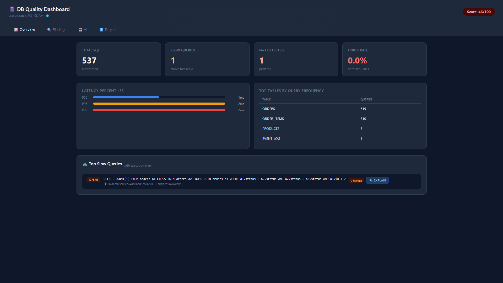
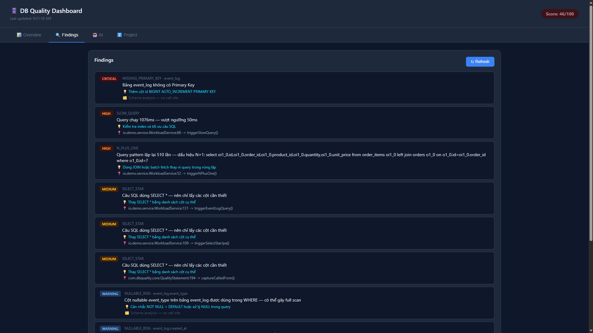
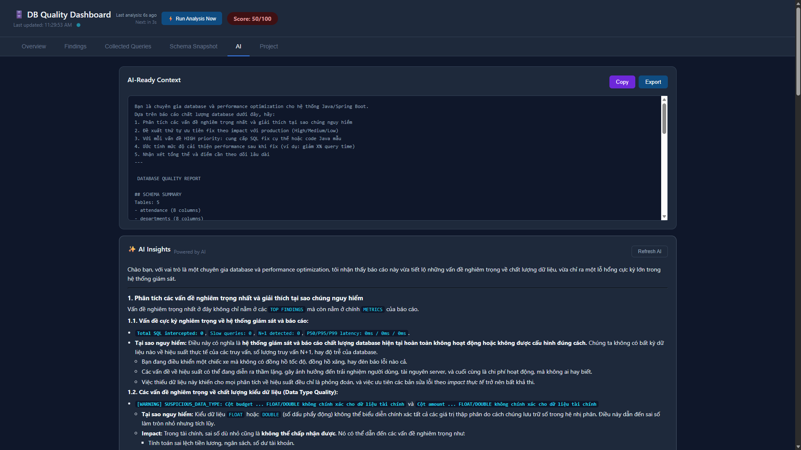
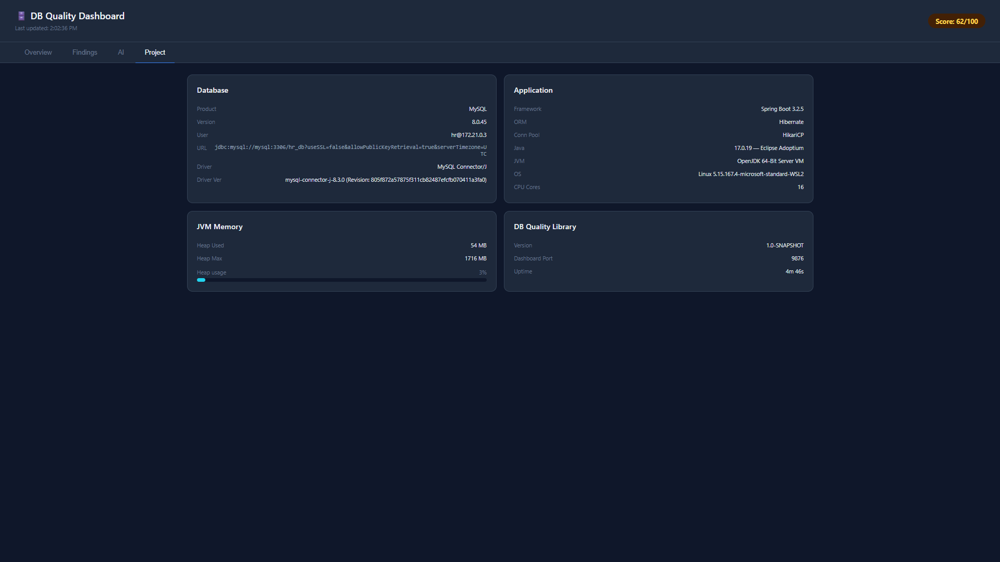
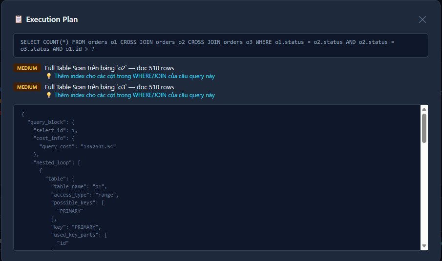

# Database Quality Library

[](https://openjdk.org/)
[](https://maven.apache.org/)
[](https://jitpack.io/#quanglam04/database-quality-library)
[](LICENSE)

> Thư viện Java phân tích chất lượng tương tác giữa ứng dụng và database tại runtime — không cần sửa bất kỳ dòng code nghiệp vụ nào.

---

## Mục lục

- [Cách hoạt động](#cách-hoạt-động)
- [Yêu cầu](#yêu-cầu)
- [Cài đặt](#cài-đặt)
- [Tích hợp](#tích-hợp)
  - [Plain Java](#plain-java)
  - [Spring Boot (Auto-configuration)](#spring-boot-auto-configuration)
  - [Spring Boot (thủ công)](#spring-boot-thủ-công)
  - [Micronaut](#micronaut)
- [Cấu hình](#cấu-hình)
- [Dashboard](#dashboard)
- [Rules](#rules)
- [Execution Plan Analysis](#execution-plan-analysis)
- [AI Integration](#ai-integration)
- [Export Report](#export-report)
- [Custom Rules](#custom-rules)
- [Mở rộng AI Provider](#mở-rộng-ai-provider)
- [Database được hỗ trợ](#database-được-hỗ-trợ)
- [Cấu trúc project](#cấu-trúc-project)
- [FAQ](#faq)

---

## Cách hoạt động

Thư viện đứng giữa ứng dụng và database, âm thầm intercept toàn bộ JDBC calls để thu thập SQL queries, thời gian thực thi, và cấu trúc schema. Sau đó chạy một bộ rules để phát hiện các vấn đề như thiếu index, N+1 queries, slow queries, và nhiều hơn nữa.

```
Không có thư viện:   App → DataSource → Database

Có thư viện:         App → QualityDataSource → DataSource → Database
                                      ↓
                              Thu thập + Phân tích
                                      ↓
                         Dashboard · JSON Report · AI Insights
```

Ứng dụng không biết mình đang bị intercept — vẫn sử dụng `DataSource` như bình thường. Toàn bộ service classes, repositories, và business logic không bị đụng đến.

---

## Yêu cầu

- Java 17+
- Bất kỳ SQL database nào có JDBC driver (MySQL, PostgreSQL, MariaDB, SQL Server, H2, ...)
- Maven 3.8+

---

## Cài đặt

### Cách 1 — JitPack (khuyến nghị)

Thêm JitPack repository và dependency vào `pom.xml`:

```xml
<repositories>
    <repository>
        <id>jitpack.io</id>
        <url>https://jitpack.io</url>
        <releases>
            <enabled>true</enabled>
        </releases>
        <snapshots>
            <enabled>true</enabled>
        </snapshots>
    </repository>
</repositories>

<dependencies>
    <dependency>
        <groupId>com.github.quanglam04</groupId>
        <artifactId>database-quality-library</artifactId>
        <version>dev-SNAPSHOT</version> <!-- Luôn dùng bản mới nhất của branch dev -->
    </dependency>
</dependencies>
```

Hoặc dùng commit hash cụ thể để pin version:

```xml
<version>dev-{COMMIT_HASH}-1</version>
<!-- Ví dụ: dev-fb0371caf1-1 -->
```

### Cách 2 — Build local

```bash
git clone https://github.com/quanglam04/database-quality-library.git
cd database-quality-library
mvn clean install -DskipTests
```

Sau đó thêm dependency:

```xml
<dependency>
    <groupId>com.dbquality</groupId>
    <artifactId>db-quality-library</artifactId>
    <version>1.0-SNAPSHOT</version>
</dependency>
```

---

## Tích hợp

### Plain Java

Wrap `DataSource` hiện có bằng `QualityDataSource`. Đây là cách tích hợp cơ bản nhất — hoạt động với **mọi Java application** không phụ thuộc framework:

```java
// Khởi tạo DataSource gốc (HikariCP, c3p0, DBCP, ...)
HikariConfig hikariConfig = new HikariConfig();
hikariConfig.setJdbcUrl("jdbc:postgresql://localhost:5432/mydb");
hikariConfig.setUsername("user");
hikariConfig.setPassword("password");
DataSource original = new HikariDataSource(hikariConfig);

// Wrap bằng QualityDataSource — đọc config từ application.properties
QualityConfig config = QualityConfig.fromClasspath();
DataSource monitored = new QualityDataSource(original, config);

// Dùng monitored thay cho original — không cần thay đổi gì khác
Connection conn = monitored.getConnection();
```

> **Lưu ý:** Nếu dùng Flyway hoặc migration tool khác, chạy migration trên `DataSource` gốc trước khi wrap — để tránh system queries của Flyway bị intercept.

```java
// Chạy Flyway trên DataSource gốc
Flyway.configure().dataSource(original).load().migrate();

// Sau đó mới wrap
DataSource monitored = new QualityDataSource(original, config);
```

### Spring Boot (Auto-configuration)

Nếu `spring-boot-autoconfigure` có trong classpath, **không cần thêm bất kỳ class nào** — thư viện tự động detect và wrap `DataSource` khi khởi động.

Chỉ cần thêm dependency và cấu hình trong `application.properties`:

```properties
quality.enabled=true
quality.dashboard.port=9876
```

### Spring Boot (thủ công)

Nếu muốn kiểm soát cấu hình hoặc tắt auto-configuration:

```java
@Configuration
public class DataSourceConfig {

    @Bean
    @Primary
    public DataSource qualityDataSource(DataSource original) {
        return new QualityDataSource(original, QualityConfig.fromClasspath());
    }
}
```

### Micronaut

Micronaut không có auto-configuration như Spring Boot, cần tạo một `@Factory` để replace `DataSource` bean mặc định:

```java
@Factory
public class DataSourceConfig {

    @Singleton
    @Replaces(DataSource.class)
    public DataSource dataSource() {
        HikariConfig hikariConfig = new HikariConfig();
        hikariConfig.setJdbcUrl(System.getenv()
            .getOrDefault("DATASOURCES_DEFAULT_URL", "jdbc:postgresql://localhost:5432/mydb"));
        hikariConfig.setUsername(System.getenv()
            .getOrDefault("DATASOURCES_DEFAULT_USERNAME", "user"));
        hikariConfig.setPassword(System.getenv()
            .getOrDefault("DATASOURCES_DEFAULT_PASSWORD", "password"));
        hikariConfig.setMaximumPoolSize(10);

        DataSource original = new HikariDataSource(hikariConfig);

        // Chạy Flyway trên DataSource gốc trước khi wrap
        Flyway.configure().dataSource(original).load().migrate();

        QualityConfig config = QualityConfig.fromClasspath();
        return new QualityDataSource(original, config);
    }
}
```

Thêm config vào `application.yml`:

```yaml
quality:
  enabled: true
  dashboard:
    enabled: true
    port: 9876
  slow-query-threshold-ms: 200
```

---

## Cấu hình

Tất cả properties đều có giá trị mặc định — chỉ cần override những gì muốn thay đổi. Thư viện đọc từ `application.properties` trên classpath qua `QualityConfig.fromClasspath()`.

```properties
# ── Chung ────────────────────────────────────────────────────────────
# Bật/tắt toàn bộ thư viện (mặc định: true)
quality.enabled=true

# Ngưỡng slow query tính bằng milliseconds (mặc định: 500)
quality.slow-query-threshold-ms=500

# Ngưỡng phát hiện N+1 — số lần lặp lại của cùng 1 query pattern (mặc định: 10)
quality.n-plus-one-threshold=10

# Sampling rate — 1.0 nghĩa là capture 100% queries (mặc định: 1.0)
quality.sampling-rate=1.0

# ── Dashboard ─────────────────────────────────────────────────────────
# Bật/tắt dashboard HTTP server (mặc định: true)
quality.dashboard.enabled=true

# Port của dashboard (mặc định: 9876)
quality.dashboard.port=9876

# ── Export ────────────────────────────────────────────────────────────
# Tự động export JSON report khi app shutdown (mặc định: false)
quality.export.json.enabled=false

# Đường dẫn file JSON output (mặc định: quality-report.json)
quality.export.json.path=quality-report.json

# ── AI Integration ────────────────────────────────────────────────────
# Bật/tắt tích hợp AI (mặc định: false)
quality.ai.enabled=false

# Provider: openai / claude / gemini (mặc định: openai)
quality.ai.provider=openai

# API key của provider
quality.ai.api-key=YOUR_API_KEY

# Tên model (mặc định: gpt-4o)
quality.ai.model=gpt-4o
```

---

## Dashboard

Khi thư viện khởi động, dashboard tự động chạy tại `http://localhost:9876`.

<p align="center">
  
  <br/>
  <em>Tab Overview — metrics tổng quan, latency percentiles, top tables và slow queries</em>
</p>

Dashboard được chia thành 4 tab:

| Tab | Nội dung |
|---|---|
| **Overview** | 4 metric cards, latency percentiles, latency trend chart (P50/P95/P99), top tables theo tần suất, top slow queries với execution plan |
| **Findings** | Danh sách tất cả findings được phân trang (10/trang), filter theo severity |
| **AI** | AI-ready context để copy/export, AI Insights từ LLM (nếu được bật) |
| **Project** | Thông tin database, framework, ORM, connection pool, JVM, memory |

<p align="center">
  
  <br/>
  <em>Tab Findings — danh sách findings được phân loại theo severity</em>
</p>

<p align="center">
  
  <br/>
  <em>Tab AI — AI-ready context và AI Insights từ LLM</em>
</p>

<p align="center">
  
  <br/>
  <em>Tab Project — thông tin database, framework, JVM và memory</em>
</p>

### API Endpoints

| Endpoint | Method | Mô tả |
|---|---|---|
| `/` | GET | HTML dashboard |
| `/metrics` | GET | Metrics realtime (JSON) |
| `/findings` | GET | Findings realtime (JSON) |
| `/report` | GET | Report đầy đủ (JSON) |
| `/slow-queries` | GET | Slow queries kèm execution plan (JSON) |
| `/ai-context` | GET | AI-ready context prompt (JSON) |
| `/project-info` | GET | Thông tin project và môi trường (JSON) |
| `/metrics-trend` | GET | Latency trend theo time bucket 30s (JSON) |
| `/ai-refresh` | POST | Reset AI cache để gọi lại LLM |

### Tắt dashboard

```properties
quality.dashboard.enabled=false
```

---

## Rules

### Tổng quan

Thư viện tích hợp sẵn 10 rules, tự động chạy sau mỗi request đến dashboard:

| Rule | Mô tả | Severity | Nguồn data |
|---|---|---|---|
| `MISSING_PRIMARY_KEY` | Bảng không có primary key | CRITICAL | DDL |
| `UNINDEXED_FOREIGN_KEY` | Cột foreign key không có index | HIGH | DDL |
| `SELECT_STAR` | Query dùng `SELECT *` | MEDIUM | SQL |
| `N_PLUS_ONE` | Cùng query pattern bị lặp lại trong vòng lặp | HIGH | SQL |
| `SLOW_QUERY` | Query vượt ngưỡng thời gian thực thi | HIGH | SQL |
| `FULL_TABLE_SCAN_CANDIDATE` | Query có khả năng gây full table scan | HIGH | SQL |
| `UNUSED_INDEX` | Index không được dùng trong session | WARNING | DDL + SQL |
| `SUSPICIOUS_DATA_TYPE` | Kiểu dữ liệu cột không phù hợp (FLOAT cho tài chính, VARCHAR cho date) | WARNING | DDL |
| `NULLABLE_RISK` | Cột nullable được dùng trong WHERE | WARNING | DDL + SQL |
| `MISSING_INDEX_SUGGESTION` | Cột dùng trong WHERE không có index | MEDIUM | DDL + SQL |

### DDL rules vs SQL rules

- **DDL rules** (`MISSING_PRIMARY_KEY`, `UNINDEXED_FOREIGN_KEY`, `SUSPICIOUS_DATA_TYPE`) — detect ngay khi khởi động từ `DatabaseMetaData`, không cần SQL nào được thực thi.
- **SQL rules** (`SELECT_STAR`, `N_PLUS_ONE`, `SLOW_QUERY`, ...) — cần SQL thực tế chạy qua mới detect được. Chạy workload hoặc gọi API trước khi xem findings.

### Scoring

Report bao gồm điểm chất lượng tổng thể từ 0 đến 100:

```
Score = 100
      - min(critical_count × 20, 60)
      - min(high_count    × 10, 30)
      - min(medium_count  ×  3, 15)
      - min(warning_count ×  1,  5)
```

---

## Execution Plan Analysis

Với mỗi slow query, thư viện tự động chạy `EXPLAIN` và parse kết quả để phát hiện thêm vấn đề:

| Finding | Mô tả |
|---|---|
| `FULL_TABLE_SCAN` | `access_type: ALL` — đọc toàn bộ bảng |
| `FULL_INDEX_SCAN` | `access_type: index` — scan toàn bộ index |
| `INDEX_NOT_USED` | Có possible keys nhưng không dùng index nào |
| `LOW_INDEX_SELECTIVITY` | Index có selectivity thấp (MariaDB) |
| `PLANNER_ESTIMATE_MISMATCH` | Planner ước tính sai số rows thực tế (PostgreSQL) |
| `SORT_TO_DISK` | Sort tràn ra disk thay vì in-memory (PostgreSQL) |
| `NESTED_LOOP_LARGE` | Nested loop join trên tập dữ liệu lớn (PostgreSQL) |

Kết quả được hiển thị trong modal khi click nút **EXPLAIN** trên tab Overview.

<p align="center">
  
  <br/>
  <em>Execution Plan modal — phân tích chi tiết query chậm</em>
</p>

### Database được hỗ trợ cho Execution Plan

| Database | Cú pháp | Trạng thái |
|---|---|---|
| MySQL 5.6+ | `EXPLAIN FORMAT=JSON` | ✅ Hỗ trợ |
| MariaDB 10.1+ | `EXPLAIN FORMAT=JSON` | ✅ Hỗ trợ |
| PostgreSQL | `EXPLAIN (FORMAT JSON, ANALYZE)` | ✅ Hỗ trợ |
| SQL Server | XML execution plan | 🔄 Planned |
| Oracle | `EXPLAIN PLAN FOR` | 🔄 Planned |
| Khác | — | Bỏ qua, không ảnh hưởng tính năng khác |

---

## AI Integration

Khi được bật, thư viện tự động gọi LLM provider với structured prompt được build từ report — bao gồm schema summary, top findings, metrics, và slow queries với calledFrom.

### Cấu hình

```properties
quality.ai.enabled=true
quality.ai.provider=gemini       # openai / claude / gemini
quality.ai.api-key=YOUR_KEY
quality.ai.model=gemini-2.5-flash
```

### Providers được hỗ trợ

| Provider | Model ví dụ | Trạng thái |
|---|---|---|
| OpenAI | `gpt-4o`, `gpt-4-turbo` | ✅ |
| Anthropic Claude | `claude-sonnet-4-6`, `claude-haiku-4-5-20251001` | ✅ |
| Google Gemini | `gemini-2.5-flash`, `gemini-1.5-pro` | ✅ |
| DeepSeek | `deepseek-chat` | 🔄 Đang phát triển |
| Grok (xAI) | `grok-2` | 🔄 Đang phát triển |

**Fallback:** Nếu AI bị tắt hoặc API call thất bại (quota, invalid key, overload), thư viện tự động fallback về rule-based output — không throw exception, ứng dụng vẫn hoạt động bình thường.

### AI-ready context (không cần API key)

Dù không bật AI integration, bạn vẫn có thể copy hoặc export AI-ready context từ tab **AI** trên dashboard và paste vào bất kỳ LLM nào (ChatGPT, Claude, Gemini) để nhận phân tích.

---

## Export Report

Khi app shutdown, thư viện tự động export report ra file JSON nếu được bật:

```properties
quality.export.json.enabled=true
quality.export.json.path=reports/quality-report.json
```

Ví dụ output:

```json
{
  "reportGeneratedAt": "2026-06-17T10:30:00Z",
  "overallScore": 62,
  "ddlFindings": [
    {
      "rule": "MISSING_PRIMARY_KEY",
      "severity": "CRITICAL",
      "table": "event_log",
      "message": "Bảng event_log không có Primary Key",
      "recommendation": "Thêm cột id BIGINT AUTO_INCREMENT PRIMARY KEY",
      "calledFrom": "Schema analysis — no call site"
    }
  ],
  "sqlFindings": [
    {
      "rule": "N_PLUS_ONE",
      "severity": "HIGH",
      "message": "Query pattern lặp lại 510 lần",
      "recommendation": "Dùng JOIN hoặc batch fetch thay vì query trong vòng lặp",
      "calledFrom": "WorkloadService:52 -> triggerNPlusOne()"
    }
  ],
  "slowQueries": [...],
  "metrics": {
    "totalSQLIntercepted": 537,
    "slowQueryCount": 1,
    "nPlusOneDetected": 1,
    "p50Latency": 1,
    "p95Latency": 2,
    "p99Latency": 7,
    "errorRate": 0.0
  }
}
```

---

## Custom Rules

Để thêm rule tùy chỉnh, implement interface `Rule`:

```java
public class TooManyTablesRule implements Rule {

    @Override
    public String getName() {
        return "TOO_MANY_TABLES";
    }

    @Override
    public Severity getSeverity() {
        return Severity.WARNING;
    }

    @Override
    public RuleResult analyze(DDLContext ddl, SQLContext sql) {
        List<Finding> findings = new ArrayList<>();

        if (ddl.getTables().size() > 50) {
            findings.add(Finding.builder()
                .rule(getName())
                .severity(getSeverity())
                .message("Schema có " + ddl.getTables().size() + " bảng — xem xét tách module")
                .recommendation("Cân nhắc tách thành các bounded context riêng biệt")
                .build());
        }

        return new RuleResult(findings);
    }
}
```

> Custom rule registration vào `RuleEngine` đang được phát triển. Hiện tại có thể extend `RuleEngine` hoặc inject rule thủ công.

---

## Mở rộng AI Provider

Thư viện được thiết kế theo **Strategy Pattern** cho AI providers — thêm provider mới không cần sửa bất kỳ code core nào, chỉ cần:

**Bước 1 — Implement interface `LLMProvider`:**

```java
public class MyCustomProvider implements LLMProvider {

    @Override
    public String call(String prompt) {
        // Gọi API của provider
        // Trả về response text hoặc error message
    }

    @Override
    public boolean isAvailable() {
        return apiKey != null && !apiKey.isBlank();
    }

    @Override
    public String getProviderName() {
        return "MyCustomProvider";
    }
}
```

**Bước 2 — Đăng ký vào `LLMProviderFactory`:**

```java
case "mycustom" -> new MyCustomProvider(config.getAiApiKey(), config.getAiModel());
```

**Bước 3 — Cấu hình:**

```properties
quality.ai.provider=mycustom
quality.ai.api-key=YOUR_KEY
quality.ai.model=your-model
```

---

## Database được hỗ trợ

Thư viện hoạt động với **mọi SQL database có JDBC driver**. Execution Plan Analysis yêu cầu parser riêng cho từng vendor:

| Database | JDBC Wrapping | Rule Engine | Execution Plan |
|---|---|---|---|
| MySQL 5.6+ | ✅ | ✅ | ✅ |
| MariaDB 10.1+ | ✅ | ✅ | ✅ |
| PostgreSQL | ✅ | ✅ | ✅ |
| SQL Server | ✅ | ✅ | 🔄 Planned |
| Oracle | ✅ | ✅ | 🔄 Planned |
| H2 | ✅ | ✅ | ❌ |
| SQLite | ✅ | ✅ | ❌ |

> Database chưa có Execution Plan parser → tính năng đó bị bỏ qua, các tính năng khác không bị ảnh hưởng.

---

## Cấu trúc project

```
db-quality-library/
│
├── src/main/java/com/dbquality/
│   ├── core/                              # Tầng wrap JDBC
│   │   ├── QualityDataSource.java         # Entry point — wrap DataSource gốc
│   │   ├── QualityConnection.java         # Wrap Connection
│   │   ├── QualityPreparedStatement.java  # Intercept PreparedStatement
│   │   └── QualityStatement.java          # Intercept Statement thường
│   │
│   ├── collector/                         # Thu thập dữ liệu
│   │   ├── SQLCollector.java
│   │   ├── SQLRecord.java                 # 1 lần thực thi SQL
│   │   ├── SQLContext.java                # Toàn bộ SQL trong session
│   │   ├── DDLCollector.java              # Thu thập schema
│   │   ├── DDLContext.java                # Cấu trúc database
│   │   ├── ProjectInfoCollector.java      # Thu thập thông tin project/môi trường
│   │   ├── ProjectInfo.java
│   │   └── model/
│   │       ├── Table.java
│   │       ├── Column.java
│   │       ├── Index.java
│   │       └── ForeignKey.java
│   │
│   ├── rule/                              # Rule engine
│   │   ├── Rule.java                      # Interface
│   │   ├── RuleEngine.java
│   │   ├── RuleResult.java
│   │   ├── Finding.java
│   │   ├── Severity.java
│   │   └── impl/                          # 10 rules tích hợp sẵn
│   │       ├── MissingPrimaryKeyRule.java
│   │       ├── UnindexedForeignKeyRule.java
│   │       ├── SelectStarRule.java
│   │       ├── NPlusOneRule.java
│   │       ├── SlowQueryRule.java
│   │       ├── FullTableScanCandidateRule.java
│   │       ├── UnusedIndexRule.java
│   │       ├── SuspiciousDataTypeRule.java
│   │       ├── NullableRiskRule.java
│   │       └── MissingIndexSuggestionRule.java
│   │
│   ├── explain/                           # Execution Plan Analysis
│   │   ├── ExplainParser.java             # Interface
│   │   ├── ExplainResult.java
│   │   ├── ExplainParserFactory.java      # Detect DB vendor và chọn parser
│   │   └── impl/
│   │       ├── MySQLExplainParser.java
│   │       ├── MariaDBExplainParser.java
│   │       ├── PostgreSQLExplainParser.java
│   │       ├── SQLServerExplainParser.java # Planned
│   │       └── OracleExplainParser.java    # Planned
│   │
│   ├── metrics/                           # Latency metrics
│   │   ├── LatencyCalculator.java         # Tính P50/P95/P99
│   │   └── MetricsCollector.java          # Thu thập theo time bucket 30s
│   │
│   ├── report/                            # Tạo output
│   │   ├── QualityReport.java
│   │   ├── MetricsReport.java
│   │   ├── SlowQueryReport.java           # Slow query + execution plan
│   │   ├── ReportBuilder.java
│   │   ├── DashboardServer.java           # Embedded HTTP server (port 9876)
│   │   ├── AIContextExporter.java         # Export AI-ready context ra file
│   │   └── JSONExporter.java
│   │
│   ├── ai/                                # AI Integration — Strategy Pattern
│   │   ├── LLMProvider.java               # Interface
│   │   ├── LLMProviderFactory.java
│   │   └── impl/
│   │       ├── OpenAIProvider.java
│   │       ├── ClaudeProvider.java
│   │       ├── GeminiProvider.java
│   │       ├── DeepSeekProvider.java      # Đang phát triển
│   │       └── GrokProvider.java          # Đang phát triển
│   │
│   ├── config/
│   │   ├── QualityConfig.java             # Đọc config từ application.properties
│   │   └── QualityAutoConfiguration.java  # Spring Boot zero-config
│   │
│   ├── constant/
│   │   ├── Constant.java                  # API endpoints, timeouts, defaults, regex patterns
│   │   └── Severity.java
│   │
│   └── util/
│       ├── SQLFilter.java                 # Filter system SQL (Flyway, Hibernate, HikariCP)
│       ├── SchemaFilter.java              # Filter system tables
│       ├── FindingUtil.java               # Phân loại findings (DDL vs SQL)
│       └── AIProviderUtil.java            # Xử lý error messages từ AI provider
│
├── src/main/resources/
│   ├── dashboard.html
│   ├── dashboard.js
│   ├── dashboard.css
│   └── META-INF/spring/
│       └── org.springframework.boot.autoconfigure.AutoConfiguration.imports
│
└── src/test/java/com/dbquality/
    ├── core/QualityDataSourceTest.java
    ├── collector/DDLCollectorTest.java
    ├── collector/SQLCollectorTest.java
    └── rule/RuleEngineTest.java
```

---

## FAQ

**Thư viện có sửa code nghiệp vụ của tôi không?**
Không. Thư viện chỉ yêu cầu wrap `DataSource` ở tầng infrastructure. Toàn bộ service classes, repositories, và business logic không bị đụng đến.

**Có hoạt động với Hibernate / JPA / MyBatis không?**
Có. Tất cả ORM frameworks đều sử dụng JDBC ở tầng cuối. Thư viện intercept ở tầng JDBC nên capture được toàn bộ queries bất kể chúng được sinh ra như thế nào.

**Tại sao Plain Java lại quan trọng?**
Vì JDBC là nền tảng chung của toàn bộ hệ sinh thái Java database. Nếu thư viện wrap được `DataSource` ở tầng JDBC thuần, tất cả frameworks phía trên (Spring Boot, Micronaut, Quarkus, ...) đều có thể dùng được vì chúng đều đi qua JDBC để kết nối database.

**Tôi không thấy finding nào sau khi khởi động?**
DDL rules (MISSING_PRIMARY_KEY, UNINDEXED_FK, SUSPICIOUS_DATA_TYPE) chạy ngay khi khởi động. SQL rules (N+1, SELECT*, SLOW_QUERY) cần SQL thực tế được thực thi — hãy gọi API hoặc chạy workload trước.

**`calledFrom` đang chỉ vào framework internal thay vì code của tôi?**
Thêm package prefix của framework vào `INTERNAL_PREFIXES` trong `Constant.java`. Thư viện duyệt stack trace và bỏ qua các frame thuộc prefix này để tìm đúng frame code nghiệp vụ.

**Nếu AI được bật nhưng thiếu API key thì sao?**
Thư viện log warning và fallback về rule-based output. Không throw exception, ứng dụng vẫn hoạt động bình thường.

**Dữ liệu có được lưu qua các lần restart không?**
Không. Toàn bộ dữ liệu lưu in-memory, reset khi restart. Đây là thiết kế có chủ đích — thư viện phân tích hành vi runtime hiện tại, không phải lịch sử.

**Có ảnh hưởng đến performance của ứng dụng không?**
Overhead rất nhỏ — chủ yếu là thời gian ghi vào in-memory buffer và stack trace capture. Với `sampling-rate=1.0`, overhead trung bình dưới 1ms mỗi query. Có thể giảm `sampling-rate` để giảm overhead.

**Dashboard có cần authentication không?**
Hiện tại không có authentication. Dashboard được thiết kế để dùng trong môi trường development/staging. Không nên expose port 9876 ra ngoài internet trong production.

**Có hỗ trợ NoSQL không?**
Không. Thư viện được thiết kế cho SQL databases truy cập qua JDBC.